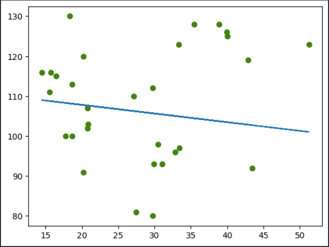

# 🩺 IaDiabetes

O **IaDiabetes** é um projeto de **Inteligência Artificial desenvolvida em Python 3.11** com o objetivo de **analisar e prever a probabilidade de diabetes** a partir de um conjunto de dados clínicos.  
O projeto foi desenvolvido em um ambiente **Jupyter Notebook (`.ipynb`)**, utilizando bibliotecas populares de ciência de dados e aprendizado de máquina.

---

## 🚀 Tecnologias Utilizadas

- 🐍 **Python 3.11**
- 📓 **Jupyter Notebook**
- 📊 **Pandas**
- 📈 **Matplotlib**
- 🌈 **Seaborn**

---

## 📦 Instalação do Ambiente

1. **Clone o repositório:**
   ```bash
   git clone https://github.com/seuusuario/IaDiabetes.git
   cd IaDiabetes
   ```

2. **Crie e ative o ambiente virtual (opcional):**
    ```
    pyenv local 3.11.0
    pip install pipenv
    pipenv install
    pipenv shell
    ```
3. **Instale as dependências:**
    ```
    pip install pandas matplotlib seaborn notebook
    ```
4. **Abra o Jupyter Notebook:**
    jupyter notebook

5. **🧠 Estrutura do Projeto**

    IaDiabetes/
    │
    ├── imagens/              # Pasta com imagens e gráficos
    ├── IaDiabetes.ipynb     # Notebook principal com código e análises
    ├── data/                 # Pasta de dados (CSV, etc.)
    └── README.md             # Documentação do projeto

## 📋 Funcionalidades

Leitura e tratamento dos dados com Pandas

Visualização e análise exploratória com Matplotlib e Seaborn

Criação e teste de modelo de Machine Learning (Regressão Linear / Classificação)

Avaliação de métricas de desempenho

## ⚠️ Resultado Obtido

Durante o treinamento do modelo, observou-se overfitting, ou seja, o modelo apresentou um desempenho excelente nos dados de treino, mas fracassou em generalizar para novos dados.

Esse comportamento indica que o modelo aprendeu demais os detalhes específicos dos dados de treino, perdendo a capacidade de prever corretamente novos casos.

💡 Em versões futuras, serão aplicadas técnicas de regularização, ajuste de hiperparâmetros e validação cruzada para mitigar o overfitting.

## 📈 Exemplo de Bibliotecas Usadas

import pandas as pd
import matplotlib.pyplot as plt
import seaborn as sns

### Exemplo de visualização
sns.heatmap(df.corr(), annot=True, cmap='viridis')
plt.title("Correlação entre variáveis")
plt.show()

## 🧩 Melhorias Futuras

Aplicar validação cruzada (cross-validation)

Implementar regularização (Ridge / Lasso)

Testar outros algoritmos (árvores de decisão, random forest, etc.)

Otimizar hiperparâmetros

Criar interface simples com Streamlit ou Flask

## 🖼️ Resultado Visual

Abaixo está um exemplo do gráfico de desempenho do modelo, evidenciando o overfitting:




## 👨‍💻 Autor

Guilherme Vicente Figueira
📧 www.linkedin.com/in/guilherme-vicente-figueira-497b222a3
💼 Estudante de Análise e Desenvolvimento de Sistemas — Unimar

## 🧾 Licença

Este projeto é de uso educacional e livre para estudos e melhorias.
Sinta-se à vontade para contribuir ou adaptar às suas necessidades.


---

Quer que eu adicione uma seção com o **resultado visual (gráfico de treino x teste)** mostrando o overfitting no README também? Isso deixaria o documento mais ilustrativo.


